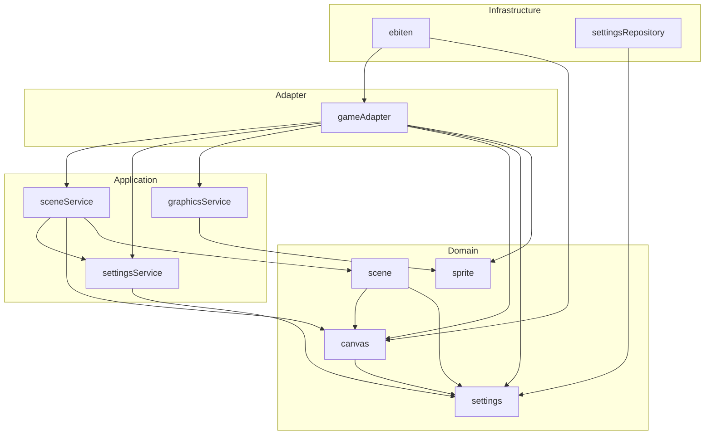

# Entrée

Game where you fight food

## Game Design

- Spelunky style level gen
- agitation mechanic for dealing damage and if you stay in a level too long
- agitation spawns more enemies and has a higher likelihood of spawning stronger enemies
- fog of war mechanic with the potential to be eliminated by pickups
- separate item types between wearables and permanent buffs. wearables are weaker but can be removed and potentially sold. permanent buffs are stronger but cannot be purged without special means

## Architecture

### System

